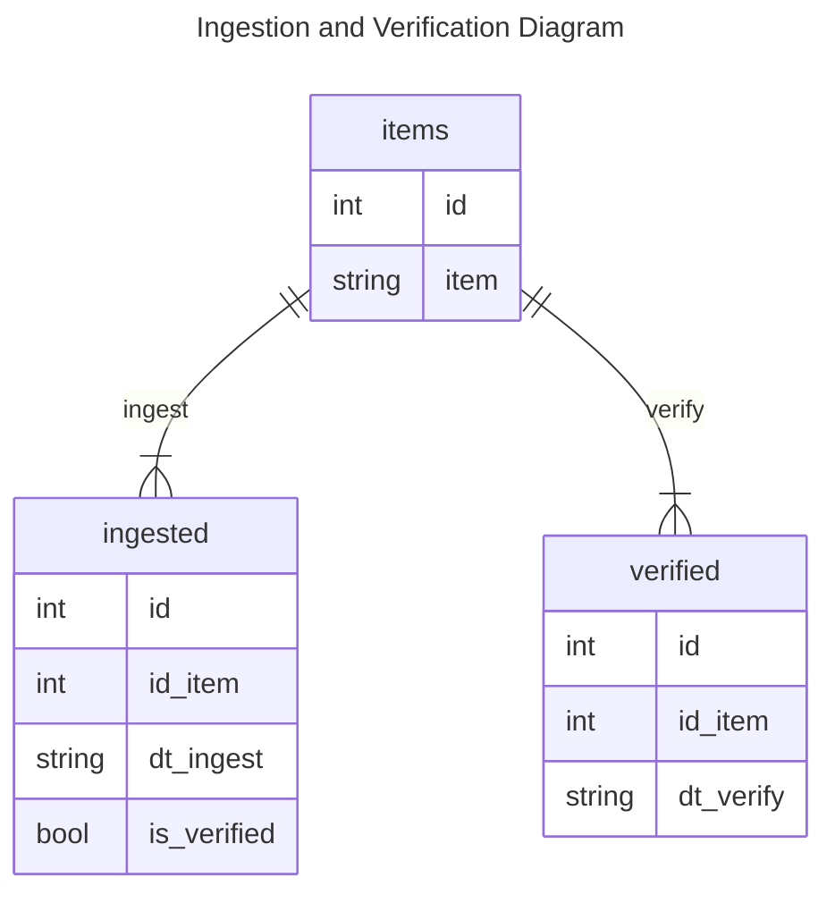
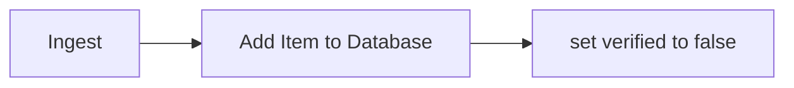
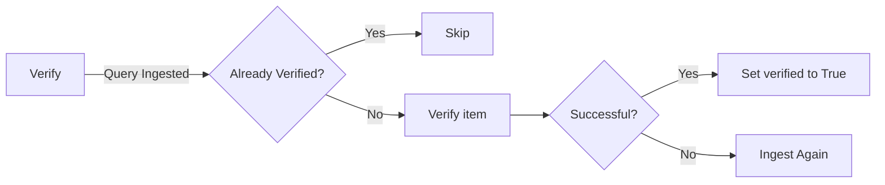

# Repo to Preservica

Script to ingest files from the institutional repository into Presevica.

Structural objects define the organisation of the data. In a library context they may be referred to as collections, in an archival context they may be Fonds, Sub-Fonds, Series etc and in a records management context they could be simply a hierarchy of folders or directories.

These structural objects may contain other structural objects in the same way as a computer filesystem may contain folders within folders.

Within the structural objects comes the information objects. These objects which are sometimes referred to as the digital assets are what PREMIS defines as an Intellectual Entity. Information objects are considered a single intellectual unit for purposes of management and description: for example, a book, document, map, photograph or database etc.

request an Asset (Information Object) by its unique reference and display some of its attributes. Information objects are considered a single intellectual unit for purposes of management and description: for example, a book, document, map, photograph or database etc.

## Configuration

Files that need to be edited before running the script:

- `.env` with the credentials to Preservica. See the file `.env_example`
- `etc/repo2preservica.cfg` with informations "run time" information like the directory with the subdirectories to ingest, which Preservica folder to use, among others.

## Virtual Environment

The extra Python libraries are installed in a virtual environment (a _venv_) to avoid polluting the Python system-wide installation. To create the virtual environment:

1. Create the environment with<br>
```python3 -m venv venv --prompt r2p```<br>
the `prompt` is optional but make easier to identify the virtual environment.
1. Activate the new environment<br>
```. venv/bin/activate```
1. Install the extra packages:<br>
```pip install --upgrade -r requirements.txt```<br>
The option `--upgrade` can be dangerous since there is no garantee that the system will work with newer versions of the library.

## The Database

Creating a simple [SQLite3](https://www.sqlite.org/index.html) database to store the ingested items.

Below is a simple [ER diagram](https://mermaid.js.org/syntax/entityRelationshipDiagram.html) of how the tables are related.



The flag `is_verified` is [boolean](https://www.sqlite.org/datatype3.html) but SQLite3 doesn't have this kind of type, instead it's an `integer` that "understands" `TRUE` and `FALSE`.

### Initializing the Database

Before the first run of the script, it's necessary to initialize the database by running the script `createdb.py.` The script will read the three SQL files and create the tables.

> Note that you must have the virtual environment activated.

```
(r2p) PS C:\Users\garcm0b\Work\repo2preservica\db_helper> python .\createdb.py
Creating table from 'items.sql'... done
Creating table from 'verify.sql'... done
Creating table from 'ingest.sql'... done
```

And this will create the db file in the parent directory

```
(r2p) PS C:\Users\garcm0b\Work\repo2preservica> ls
(...)
-a---            9/5/2023  2:18 PM          16384 r2p.db
```

### Using the Database

The SQLite3 database is just a file that can be use very easily

```
(venv) library-sds@lthlibtest:/data/scripts/repo2preservica$ sqlite3 r2p.db
SQLite version 3.31.1 2020-01-27 19:55:54
Enter ".help" for usage hints.
sqlite> select * from items;
1|10754_136194
2|10754_136195
3|10754_136193
sqlite> select * from ingested;
1|1|2023-09-13|0
2|2|2023-09-13|0
3|3|2023-09-13|0
sqlite> select * from verified;
sqlite>
sqlite> .quit
(venv) library-sds@lthlibtest:/data/scripts/repo2preservica$
```

## Flowchart

Whenever an item is ingested, the flag `is_verified` is set to _false_ ("0" in SQLite3).



The verification step sets the flag to _true_ ("1" in SQLite3) if successful or other value in case of error. Note that if verification fails, the item will still be considered verified.



## Command Line Options

### Default Behavior

The default behavior, that is, without any other command line options, for scripts are:

- `ingest.py`: ingest all items in the `parent folder` defined in the  configuration file `etc/repo2preservica.cfg`.
- `verify.py`: verify the SHA1 of all items ingested by not verified.

### Changing Options

The general configuration is located in the `etc` directory, but details can be customized with some command line options:

- Options to the `ingest` script:

  - `-i | --input-folder`: specify the folder with the items to ingest.
  - `-p | --parent-folder`: The parent folder in Preservica.
  - `-n | --no-upload`: This option is to test the verification, by add item to the database, but not uploading to Preservica.

```
(r2p) library-sds@lthlibtest:/data/scripts/repo2preservica$ python src/ingest.py --help
Usage: ingest.py [OPTIONS]

  Ingest items from repository into Preservica

Options:
  -i, --input-folder TEXT   Folder with the items to ingest
  -p, --parent-folder TEXT  Preservica parent folder
  -n, --no-upload BOOLEAN   Doesn't upload to Preservia
  --help                    Show this message and exit.
(r2p) library-sds@lthlibtest:/data/scripts/repo2preservica$
```

- Options to the `verify` parameter:

  - `-i | --item`: verify a single item .
  - `-l | --list 'filename'`: file with a list of items to verify.

```
(r2p) library-sds@lthlibtest:/data/scripts/repo2preservica$ python src/verify.py --help
Usage: verify.py [OPTIONS]

Options:
  -i, --item TEXT       Item to verify checksum
  -l, --file-list TEXT  Input file with list of items to verify
  --help                Show this message and exit.
(r2p) library-sds@lthlibtest:/data/scripts/repo2preservica$
```

> The `history` is not implemented yet. Ignore this part for now.

- Options for the `history` parameter:
  - `-a | --all`: list all ingested items.
  - `-s | --start-date YYYY-MM-DD`: list ingestion starting from `start-date`.
  - `-l | --list 'filename'`: file with list of items to verify.


## Running the Script

The script will try to import all folders in `input_folder` defined in the `etc/repo2preservica.cfg` file. It will say how many folders it was found, and the log messages will inform of the progress, like uploading or skipping because the folder already exists in Preservica.

```
(venv) library-sds@lthlibtest:/data/scripts/repo2preservica$ python src/ingest.py
INFO:root:do_upload: 'True'
INFO:root:Entity: 'pyPreservica version: 2.0.7  (Preservica 6.9 Compatible) Connected to: preservica.com Preservica version: 6.9.0 as...
input_file: '/data/scripts/repo2preservica/etc/repo2preservica.cfg'
INFO:root:input folder: None
INFO:root:Files will be ingest into 'REPOSITORY_ETD_TEST'.
INFO:root:Start of bagging process.
INFO:root:We found 8 folders to scan
INFO:root:Creating Preservica folder '10754_136209'
(...)
```

The verification of ingested items:

```
(venv) library-sds@lthlibtest:/data/scripts/repo2preservica$ python src/verify.py
input_file: '/data/scripts/repo2preservica/etc/repo2preservica.cfg'
res: '<sqlite3.Cursor object at 0x14a822eaaa40>'
updated_folders: ['10754_136194', '10754_136195', '10754_136193']
Bag name: '10754_136194'
INFO:root:10754_136194.json is the same
INFO:root:10754_136194.xml is the same
INFO:root:147585-295970.json is the same
INFO:root:147585-295971.json is the same
INFO:root:147585-295971.pdf is the same
INFO:root:147585-295972.json is the same
INFO:root:147585-295972.pdf is the same
INFO:root:data/147585-295970.metadata is the same
INFO:root:data/147585-295970.pdf is the same
Bag name: '10754_136195'
(...)
```

## Pywin32 and Linux

When installing on Linux, the `pip install` will fail because the package `pywin32` is missing. The [workaround is to add a parameter](https://github.com/mhammond/pywin32/issues/1739) to the entry of the package in the `requirements.txt` marking as Windows only package

```
pywin32==305; platform_system=="Windows"
```

When installing on Linux, you will see message about ignoring the package

```
(venv) mgarcia@PC-KL-21621:~/Work/repo2preservica$ pip install -r requirements.txt
Ignoring pywin32: markers 'platform_system == "Windows"' don't match your environment
(...)
```
